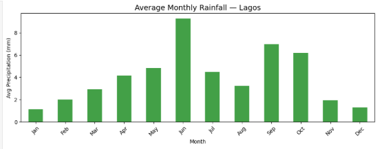
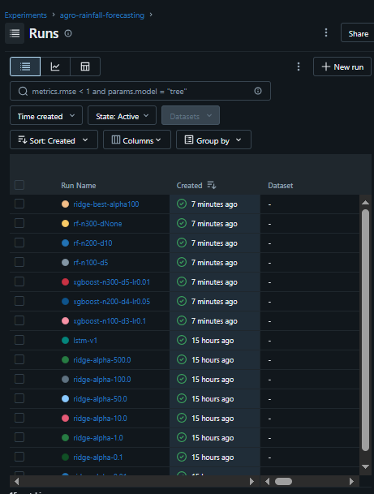

# 🌾 Lagos Agricultural Weather Forecast

An end-to-end automated ML system that predicts next-day rainfall for Lagos, Nigeria — 
built for agricultural planning and designed to run fully autonomously.

🔴 **Live Dashboard → [badasz-agro-weather-forecast.streamlit.app](https://badasz-agro-weather-forecast.streamlit.app/)**

---

## 🎯 Project Overview

This project demonstrates a production-grade ML engineering workflow applied to a 
real-world agricultural problem. The system ingests live weather data daily, makes 
rainfall predictions, monitors model performance over time, and surfaces everything 
on a public dashboard — all without manual intervention.

**Why rainfall forecasting for Lagos?**
Lagos has a bimodal rainfall pattern with two distinct wet seasons peaking in June 
and September/October, interrupted by the famous "August Break" — a mid-year dry spell 
embedded inside the wet season. This makes it a genuinely interesting forecasting 
problem with real agricultural stakes.

---

## 🏗️ System Architecture
```
Open-Meteo API (free, no key needed)
       │
       ▼
Monthly Ingestion (GitHub Actions cron)
       │
       ▼
Data Quality Gate (custom checks — 18 validations)
       │ PASS                    │ FAIL → keep existing model, alert via email
       ▼
Feature Engineering (lag features, rolling stats, season flags)
       │
       ▼
Model Retraining (Ridge Regression + alpha hyperparameter tuning → MLflow)
       │
       ▼
Model Registry (best model + scaler saved to repo)
       │
       ▼
Daily Prediction (GitHub Actions cron @ 6am WAT)
       │
       ├──→ Predictions + Actuals → SQLite Database
       │
       └──→ Model Monitoring (rolling MAE, drift detection, season breakdown)
                    │
                    ▼
          Streamlit Dashboard (public, live)
```

---

## ✨ Features

- **Live data ingestion** via [Open-Meteo Archive API](https://archive-api.open-meteo.com) — no API key required
- **Automated monthly retraining** with Ridge Regression hyperparameter tuning across 7 alpha values
- **Full MLflow experiment tracking** — all runs logged, best model registered
- **18-point data quality gate** — validates ranges, nulls, row counts, date continuity before every retrain
- **Auto-repair pipeline** — interpolates gaps, clips corrupt values, re-fetches if row count is too low
- **Daily predictions** stored in SQLite with automatic backfill for any failed fetches (retry with exponential backoff)
- **Model drift monitoring** — rolling MAE vs baseline, 30% degradation threshold, season-level breakdown
- **Public Streamlit dashboard** — forecast, accuracy charts, quality reports, drift alerts
- **Fully automated via GitHub Actions** — zero manual intervention after deployment
- **Data retention policy** — automatic cleanup of records older than 1 year (predictions) / 6 months (monitoring)

---

## 🧠 ML Design Decisions

### Why Ridge Regression over LSTM?
After training both models, Ridge Regression (α=100) achieved an MAE of **1.8536mm** 
and R² of **0.1988**, while the LSTM achieved MAE of **1.8534mm** but R² of **-0.0933** 
— meaning the LSTM performed worse than a mean baseline. With only ~700 rows of daily 
data, the LSTM had insufficient data to learn meaningful temporal patterns. Ridge wins 
on simplicity, interpretability, and performance.

### Why these features?
EDA revealed Lagos' bimodal rainfall pattern with specific seasonal signals:

| Feature | Rationale |
|---|---|
| `precip_lag_1/3/7` | Yesterday's and last week's rainfall is the strongest predictor |
| `precip_roll7/14_mean` | Captures wet/dry spell momentum |
| `is_peak_rain` (Jun, Sep, Oct) | Explicit encoding of the two rainy season peaks |
| `is_aug_break` | The mid-wet-season dry anomaly — unintuitive without domain knowledge |
| `is_wet_season` / `is_dry_season` | Broad seasonal context |
| `et0_fao_evapotranspiration` | Soil moisture proxy — highly relevant for agriculture |

### Why chronological split?
Time series data must never be randomly shuffled. Using the last 10% of dates as the 
test set prevents data leakage and reflects real-world deployment where you always 
predict the future from the past.

---

## 📊 EDA Insights

Average monthly rainfall for Lagos clearly shows the bimodal pattern:



Key findings:
- **June** — dominant first peak (~9mm/day average)
- **August** — the "August Break" mini dry spell (~3.5mm) embedded in the wet season
- **September/October** — second peak (~6.5–7mm)
- **November–March** — dry season, near-zero rainfall

---

## 🔬 MLflow Experiment Results

All model runs tracked and compared in MLflow:



| Model | Val MAE | Test MAE | Test R² |
|---|---|---|---|
| Ridge α=0.01 | ~1.92 | ~1.91 | ~0.15 |
| Ridge α=100  | **1.8536** | **1.8536** | **0.1988** |
| Ridge α=500 | ~1.87 | ~1.88 | ~0.18 |
| LSTM (2-layer) | ~1.85 | ~1.85 | -0.09 |
| XGBoost | ~1.91 | ~1.90 | ~0.16 |
| Random Forest | ~1.89 | ~1.89 | ~0.17 |

---

## 🗂️ Project Structure
```
agro-weather-forecast/
├── .github/workflows/
│   ├── monthly_pipeline.yml   # ingest → quality → features → retrain
│   └── daily_predict.yml      # predict → monitor → commit to DB
├── src/
│   ├── ingestion.py           # Open-Meteo API fetch
│   ├── features.py            # feature engineering + train/val/test split
│   ├── quality.py             # 18-point data quality gate with auto-repair
│   ├── train.py               # Ridge + LSTM + hyperparameter tuning
│   ├── train_xgb.py           # XGBoost + RandomForest comparison
│   ├── train_final_model.py   # final model trained on train+val combined
│   ├── predict.py             # daily inference + backfill + retry logic
│   ├── monitor.py             # rolling MAE, drift detection, season breakdown
│   ├── database.py            # SQLite schema + CRUD helpers + retention policy
│   └── backfill.py            # historical backfill script
├── app/
│   └── streamlit_app.py       # public dashboard
├── api/
│   └── main.py                # FastAPI REST endpoint
├── notebooks/
│   └── eda.ipynb              # exploratory data analysis
├── artifacts/                 # screenshots and figures
├── data/                      # auto-managed by pipeline
├── docker-compose.yml
├── Dockerfile
├── pyproject.toml
└── README.md
```

---

## 🚀 Run Locally

**Prerequisites:** Python 3.11+, [uv](https://github.com/astral-sh/uv)
```bash
# Clone and install
git clone https://github.com/Badaszz/agro-weather-forecast.git
cd agro-weather-forecast
uv sync

# Run the full pipeline
uv run python -m src.ingestion          # fetch 2 years of Lagos weather data
uv run python -m src.quality            # validate data quality
uv run python -m src.features           # engineer features
uv run python -m src.train_final_model  # train and save best model

# Run daily pipeline
uv run python -m src.predict            # predict today + save to DB
uv run python -m src.monitor            # evaluate + detect drift

# Launch dashboard
uv run streamlit run app/streamlit_app.py

# Launch REST API
uv run uvicorn api.main:app --reload --port 8000
```

**Backfill historical data (first time setup):**
```bash
uv run python -m src.backfill
```

---

## 🐳 Docker
```bash
docker-compose up --build
```

Services:
- `api` → FastAPI prediction endpoint at `http://localhost:8000`
- `mlflow` → experiment tracking UI at `http://localhost:5000`
- still in production, not deployed yet
---

## 🌐 REST API
```bash
# Health check
GET http://localhost:8000/health

# Predict today's rainfall
POST http://localhost:8000/predict
{
  "location": "Lagos, Nigeria",
  "latitude": 6.5244,
  "longitude": 3.3792
}

# Predict for a specific date
POST http://localhost:8000/predict/date
{
  "date": "2025-11-15",
  "latitude": 6.5244,
  "longitude": 3.3792
}
```

---

## 🔄 Automation Schedule

| Workflow | Schedule | What it does |
|---|---|---|
| `monthly_pipeline.yml` | 1st of every month @ 6am WAT | Ingest → Quality gate → Retrain |
| `daily_predict.yml` | Every day @ 6am WAT | Predict → Monitor → Commit |

---

## 🛠️ Tech Stack

| Layer | Technology |
|---|---|
| Language | Python 3.11 |
| Package manager | uv |
| ML | scikit-learn, PyTorch, XGBoost |
| Experiment tracking | MLflow |
| Data validation | Custom quality gate (18 checks) |
| Storage | SQLite |
| API | FastAPI |
| Dashboard | Streamlit |
| Automation | GitHub Actions |
| Deployment | Streamlit Cloud |
| Containerisation | Docker + Docker Compose |
| Data source | Open-Meteo Archive API |

---

## 📬 Contact

Built by **Yusuf Solomon**  
[GitHub](https://github.com/Badaszz) · [LinkedIn](www.linkedin.com/in/yusuf-solomon) · [X](https://x.com/I_BadaSZ)